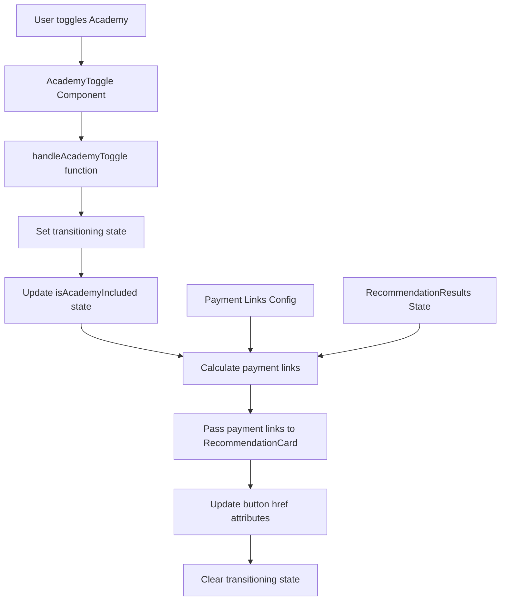
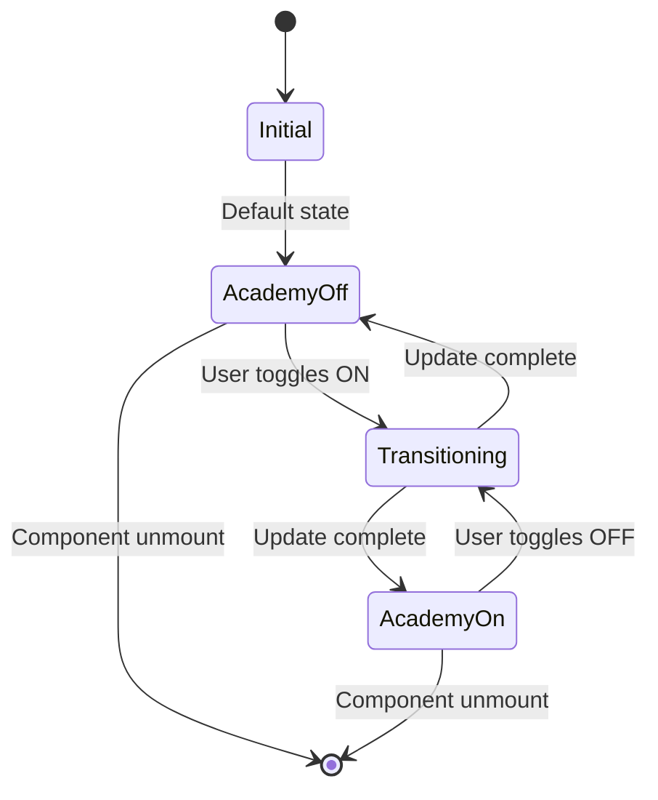
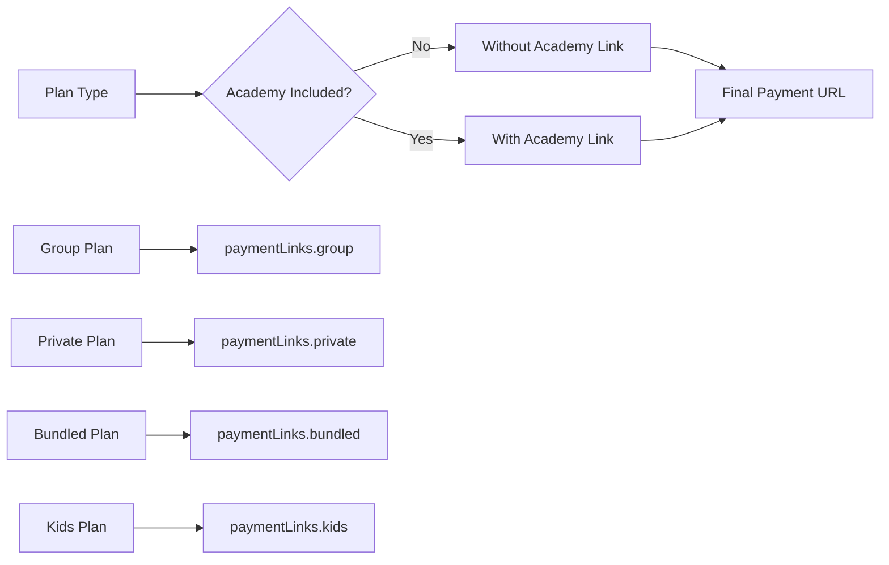
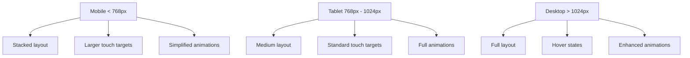
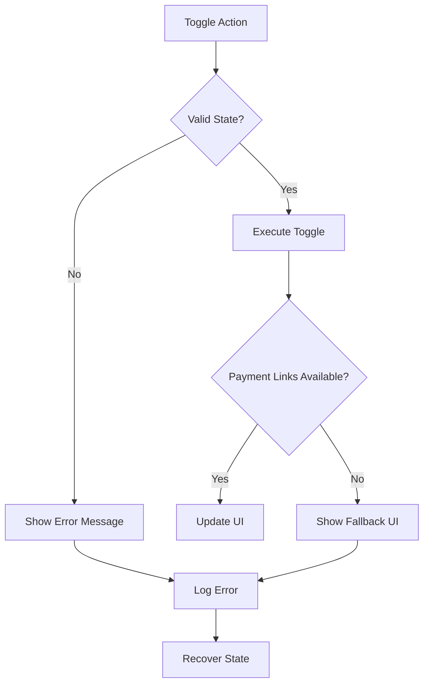

# Academy Toggle Architecture Diagram

## Component Hierarchy

```
RecommendationResults
├── AcademyToggle (NEW)
│   ├── Switch (from @/components/ui/switch)
│   └── Card (from @/components/ui/card)
├── RecommendationCard (UPDATED)
│   ├── Button (dynamic payment link)
│   └── Loading state handling
└── Other existing components
```

## Data Flow Diagram



## State Management Flow



## Component Props Interface

### AcademyToggle Props
```typescript
interface AcademyToggleProps {
  isChecked: boolean;
  onChange: (checked: boolean) => void;
  isLoading?: boolean;
}
```

### Updated RecommendationCard Props
```typescript
interface RecommendationCardProps {
  content: RecommendationContent;
  type: 'group' | 'private' | 'kids' | 'bundled';
  isPrimary?: boolean;
  onSelect?: () => void;
  onViewDetails?: () => void;
  paymentLink?: string; // NEW
  isLoading?: boolean; // NEW
}
```

## Payment Link Resolution Logic



## Responsive Breakpoints



## Animation Timeline

```mermaid
gantt
    title Toggle Animation Timeline
    dateFormat X
    axisFormat %s
    
    section User Interaction
    Toggle Click : 0, 0.1
    
    section Loading State
    Set Loading : 0.1, 0.2
    Disable Interactions : 0.1, 0.4
    
    section Visual Feedback
    Color Transition : 0.1, 0.3
    Switch Animation : 0.1, 0.2
    
    section State Update
    Update Links : 0.2, 0.3
    Re-render Cards : 0.3, 0.4
    
    section Completion
    Clear Loading : 0.4, 0.5
    Enable Interactions : 0.4, 1.0
```



## Accessibility Implementation

### ARIA Label Structure
```typescript
// Toggle component
aria-label="Include SpanishVIP Academy premium add-on"
aria-checked={isChecked}
aria-describedby="academy-description"

// Description element
id="academy-description"
```

### Keyboard Navigation
```typescript
// Key bindings
Space: Toggle state
Enter: Toggle state
Tab: Navigate to next focusable element
Shift+Tab: Navigate to previous focusable element
```

## Error Handling Strategy



## Performance Optimizations

1. **Debouncing**: Prevent rapid toggle state changes
2. **Memoization**: Cache payment link calculations
3. **Lazy Loading**: Load payment link config only when needed
4. **Optimized Re-renders**: Use React.memo for expensive components
5. **Animation Performance**: Use CSS transforms instead of layout changes

## Testing Strategy Matrix

| Test Type | Component | Focus Area | Priority |
|-----------|-----------|-------------|----------|
| Unit | AcademyToggle | Toggle behavior, state changes | High |
| Unit | RecommendationCard | Payment link updates | High |
| Integration | RecommendationResults | State management | High |
| Accessibility | All | ARIA compliance | Medium |
| Responsive | AcademyToggle | Mobile layout | Medium |
| E2E | Full flow | User journey | Low |