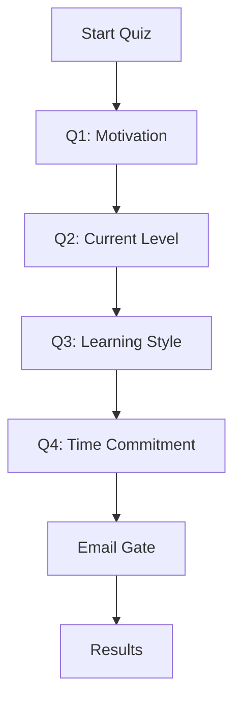
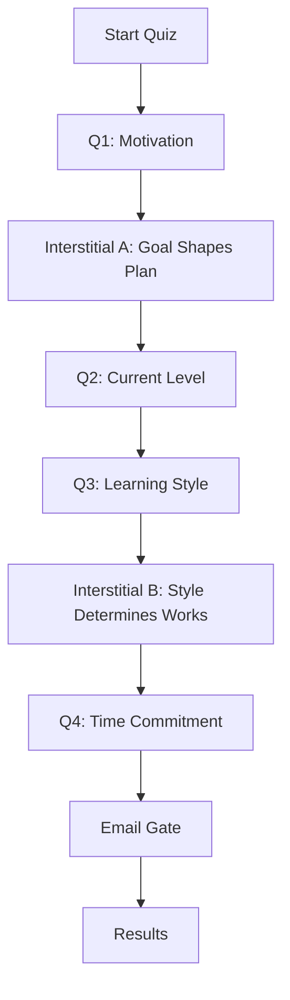
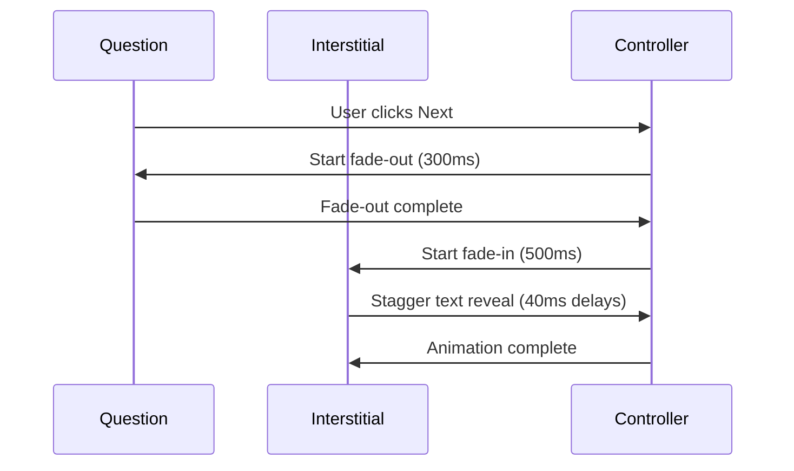
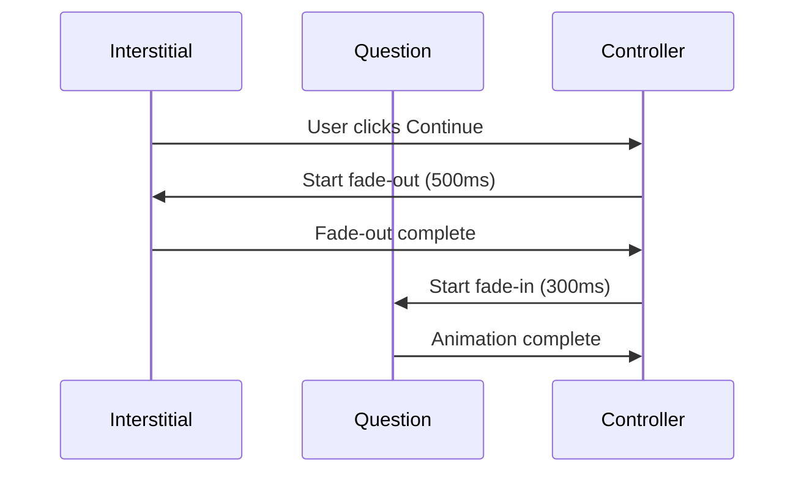

# Quiz Flow with Interstitial Steps

## Current Flow vs New Flow

### Current Quiz Flow


### New Quiz Flow with Interstitials


## Interstitial Content Structure

### Interstitial A (After Q1)
```
Headline: "Your goal shapes your plan"
Body: "Factors like travel, family, or personal growth change what you should practice first. A focused plan builds confidence faster."
Bullets:
• Real conversation practice
• CEFR roadmap
• Flexible group or 1-on-1 options
Footer: "Why we ask: matching your goal = fewer detours, more wins."
```

### Interstitial B (After Q3)
```
Headline: "Your style determines what works"
Body: "Prefer group energy, 1-on-1 guidance, or a combo? We'll align activities for the right mix of speaking, feedback, and structure."
Bullets:
• Live classes
• Targeted home practice
• Easy schedule swaps
Footer: "What's next: tell us your weekly time — we'll fit sessions to your routine."
```

## Animation Flow

### Question → Interstitial Transition


### Interstitial → Question Transition


## State Management

### Quiz State Structure
```typescript
type QuizStage = "questions" | "interstitial-a" | "interstitial-b" | "email-gate" | "results" | "thank-you"

interface QuizState {
  stage: QuizStage;
  currentQuestionId: string | null;
  questionHistory: string[];
  isTransitioning: boolean;
  showInterstitial: boolean;
  interstitialType: 'a' | 'b' | null;
}
```

### Transition Logic
```typescript
// After Q1 → Interstitial A
if (currentQuestionId === 'q1' && nextQuestionId === 'q2') {
  showInterstitial('a');
}

// After Q3 → Interstitial B  
if (currentQuestionId === 'q3' && nextQuestionId === 'q4') {
  showInterstitial('b');
}
```

## Component Hierarchy

### Main Quiz Controller
```
QuizController
├── Logo (hidden during interstitials)
├── ProgressBar (hidden during interstitials)
├── QuestionCard (for questions)
├── InterstitialStep (for interstitials)
└── EmailGateModal
```

### InterstitialStep Component
```
InterstitialStep
├── Full-screen container
├── Centered content wrapper
├── Animated headline
├── Animated body text
├── Staggered bullet list
├── Micro-footer
└── Continue button
```

## Animation Timing

### Interstitial Entry
1. Container fade-in: 0-500ms
2. Headline reveal: 100-600ms
3. Body reveal: 140-640ms
4. Bullet 1: 180-680ms
5. Bullet 2: 220-720ms
6. Bullet 3: 260-760ms
7. Footer: 300-800ms
8. Button: 340-840ms

### Interstitial Exit
1. Container fade-out: 0-500ms
2. All elements fade together

## Responsive Breakpoints

### Mobile (< 768px)
- Full-width content
- Larger text for readability
- Touch-friendly button (48px min height)

### Desktop (≥ 768px)
- Max-width container (640px)
- Optimized spacing
- Hover states for interactive elements

## Accessibility Considerations

1. **Reduced Motion**: Respect `prefers-reduced-motion`
2. **Keyboard Navigation**: Full keyboard support
3. **Screen Readers**: Proper ARIA labels and roles
4. **Focus Management**: Logical focus flow
5. **Color Contrast**: WCAG AA compliance

## Performance Optimizations

1. **CSS Transforms**: Use transform instead of layout changes
2. **Will-change**: Optimize for animations
3. **Cleanup**: Proper state cleanup on unmount
4. **Memoization**: Prevent unnecessary re-renders